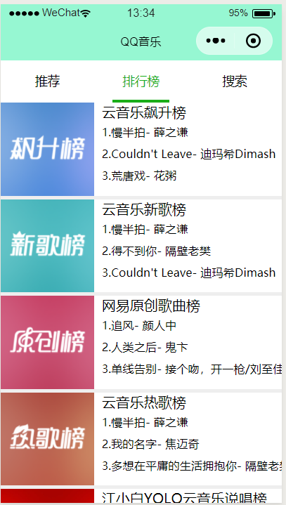
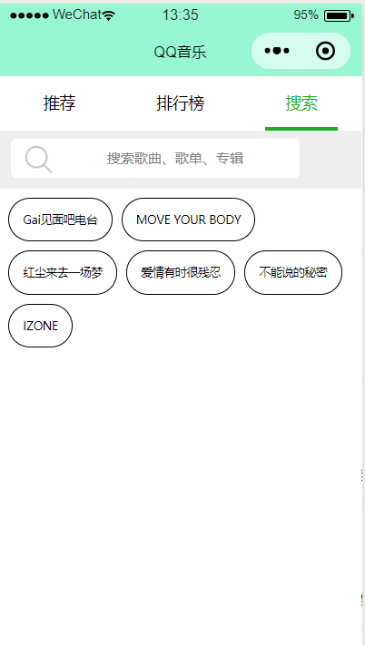
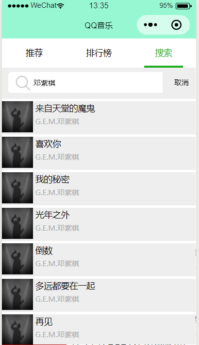
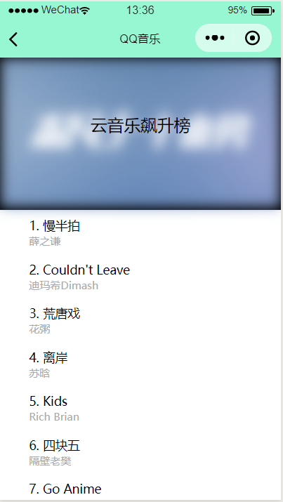

# QQMusic

使用github上一个大佬提供的

[https://binaryify.github.io/NeteaseCloudMusicApi/#/]: 网易云API

通过调用网易云的音乐排名接口，搜索接口，推荐歌单接口，音乐详细信息接口等实现的一个音乐播放小程序，目前可以完成音乐搜索，音乐推荐，音乐播放功能。

使用方法：

1.先在github上下载网易云音乐的后台接口

> <https://github.com/Binaryify/NeteaseCloudMusicApi> 

2.下载好后按照文档的方法运行api

> <https://binaryify.github.io/NeteaseCloudMusicApi/#/?id=%e8%bf%90%e8%a1%8c> 

3.然后用微信官方编译软件打开这个项目

